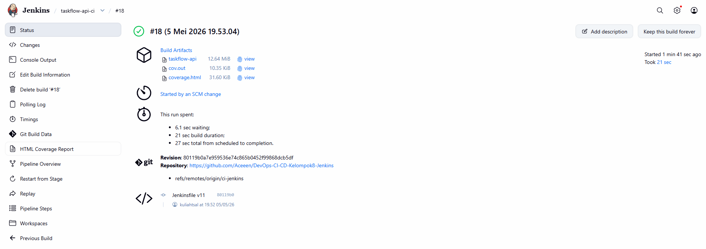
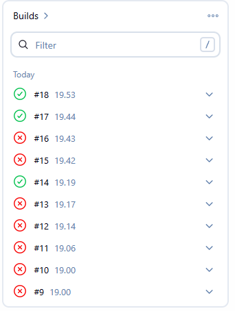
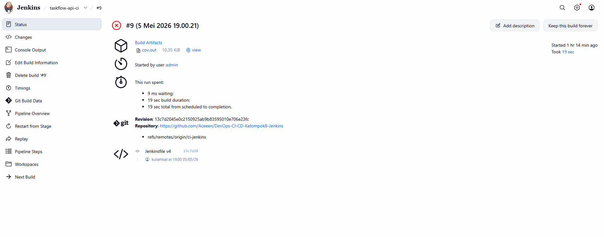
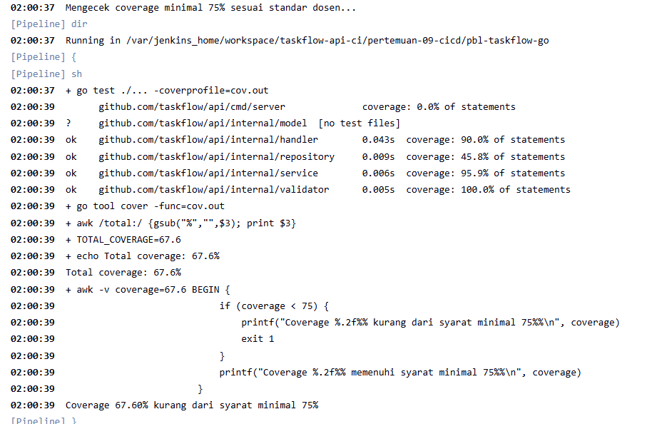
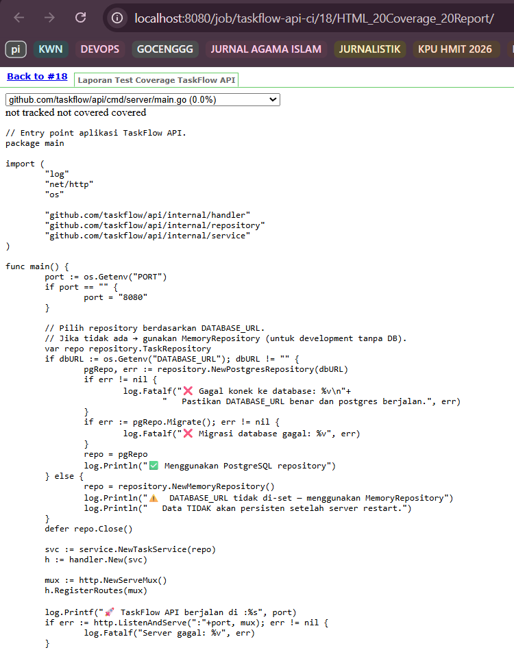

# Skenario 2: CI Pipeline Automation (Jenkins)

**Kelompok**: 8  
**Engineer**: Orang 2 (CI Engineer)  
**Tool**: Jenkins (Declarative Pipeline)  
**Platform**: Docker Lokal  
---

## 1. Deskripsi Tugas
Membangun sistem *Continuous Integration* (CI) otomatis menggunakan **Jenkins** yang berjalan di atas **Docker Lokal**. Pipeline ini berfungsi sebagai "Quality Gate" untuk memastikan setiap kode yang di-push ke repository memenuhi standar kualitas sebelum dapat dideploy.

### Fokus Khusus:
*   **Declarative Jenkinsfile**: Menggunakan struktur pipeline modern yang terorganisir.
*   **Docker Lokal**: Jenkins berjalan di dalam container Docker.
*   **Integrasi Database**: Menjalankan PostgreSQL container secara dinamis untuk pengujian.
*   **Quality Gate**: Memblokir build jika coverage < 75% atau jika ditemukan *race condition*.

---

## 2. Panduan Setup & Cara Menjalankan
Untuk mereplikasi environment CI ini di laptop lokal, ikuti langkah-langkah berikut:

### A. Menjalankan Server Jenkins
Gunakan Docker untuk menjalankan Jenkins dengan akses ke Docker socket host (Sibling Container):
```bash
docker run -d -p 8080:8080 -p 50000:50000 --name jenkins-devops \
  -v /var/run/docker.sock:/var/run/docker.sock \
  -v jenkins_home:/var/jenkins_home \
  jenkins/jenkins:lts
```
*   **Port 8080**: Digunakan untuk mengakses Dashboard Jenkins.
*   **docker.sock**: Diperlukan agar Jenkins bisa memanggil perintah Docker (untuk container database).

### B. Memberikan Izin Akses Docker (Wajib)
Setelah container Jenkins berjalan, berikan izin akses ke socket docker agar tidak terjadi error `permission denied`:
```bash
docker exec -u 0 -it jenkins-devops chmod 666 /var/run/docker.sock
```

### C. Konfigurasi Plugin & Tool di Jenkins UI
1.  **Install Plugins**: `Go Plugin`, `HTML Publisher`.
2.  **Global Tool Configuration**: Tambahkan Go dengan nama `go-1.22` dan versi `1.22.x`.
3.  **Trigger**: Aktifkan **Poll SCM** dengan schedule `* * * * *` (setiap menit) untuk simulasi otomatisasi di localhost.

---

## 3. Detail Tahapan Stage (Quality Gate)

| Stage | Fungsi | Deskripsi Teknis |
|-------|--------|------------------|
| **Go Vet** | Static Analysis | Menjalankan `go vet` untuk mendeteksi kesalahan semantik kode. |
| **Unit Test** | Race Detection | Menjalankan test dengan `CGO_ENABLED=1` dan `-race` untuk mendeteksi data race. |
| **PostgreSQL** | Integration Test | Menyalakan container `postgres:16-alpine` secara dinamis. Menggunakan IP `172.17.0.1` sebagai gateway komunikasi antar container. |
| **Coverage Check**| Quality Gate | Menghitung persentase coverage. Build otomatis **GAGAL** jika coverage di bawah **75%**. |
| **Build Binary** | Compilation | Melakukan kompilasi menjadi binary Linux `taskflow-api`. |

---

## 4. Troubleshooting & Solusi Teknis

Beberapa tantangan teknis yang berhasil dipecahkan:
1.  **Komunikasi Antar Container**: Menggunakan IP Gateway `172.17.0.1` pada `DATABASE_URL` karena `localhost` di dalam Jenkins merujuk pada container itu sendiri, bukan host atau container DB.
2.  **Race Detector Requirement**: Menginstal `gcc` dan `libc6-dev` di dalam container Jenkins menggunakan `apt-get` agar Go dapat menjalankan Race Detector.
3.  **Jenkins HTML Security**: Memperbaiki tampilan laporan HTML yang polos (tanpa CSS) dengan menjalankan script Admiral CSP:
    ```bash
    docker exec -u 0 -it jenkins-devops curl -X POST http://localhost:8080/admiral/script -d "script=System.setProperty('hudson.model.DirectoryBrowserSupport.CSP', '')"
    ```

---

## 5. Hasil Akhir (Evidence)

### ✅ Pipeline Sukses (HIJAU)
Pipeline berhasil melewati semua tahap dengan **Total Coverage 80.7%**.  
  
  

### ❌ Pipeline Gagal (MERAH)
Bukti sistem CI memblokir kode jika coverage di bawah 75% atau terdapat test yang gagal.  
  
  


### 📦 Artifacts
File yang dihasilkan dan disimpan sebagai hasil build stabil:
1.  `taskflow-api` (Executable Binary)
2.  `coverage.html` (Laporan Visual Interaktif)
3.  `cov.out` (Data Mentah Coverage)  
  

---
