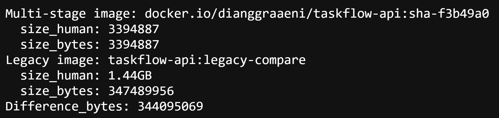
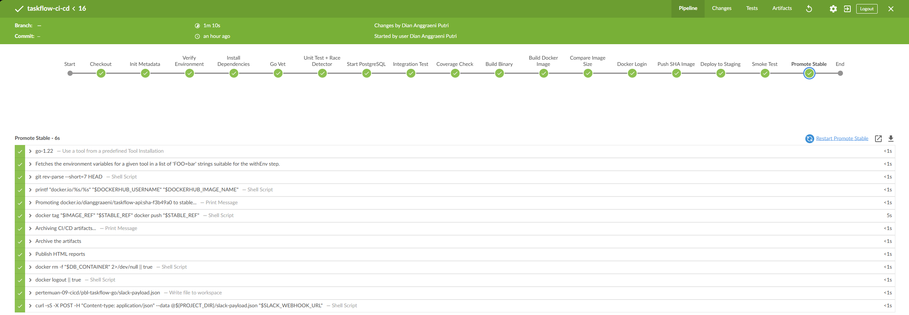
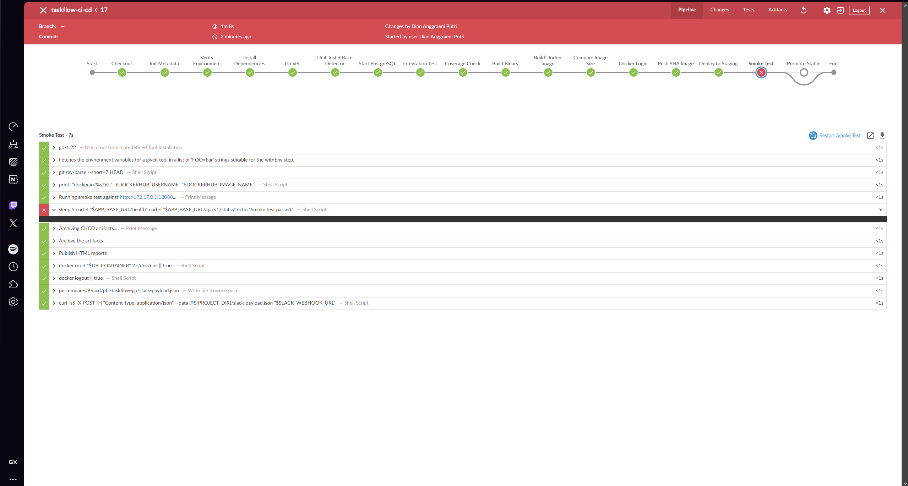
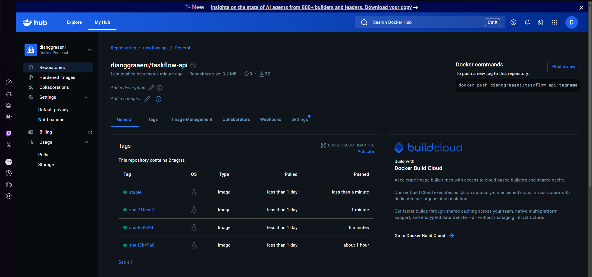
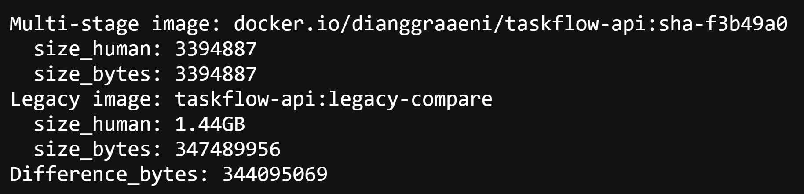
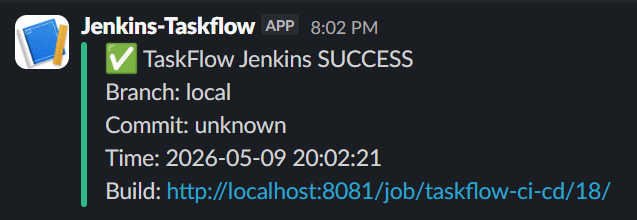
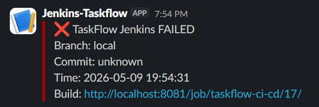

# Skenario 3 & 4 — Docker Image, Deploy, & Smoke Test

**Kelompok**: 8 | **Tool CI/CD**: Jenkins + Docker Hub  
**Engineer**: Orang 3 — DevOps Engineer  
**Platform**: Docker lokal (Jenkins via `Dockerfile.jenkins`)

---

## Daftar Isi

1. [Gambaran Umum](#gambaran-umum)
2. [Prasyarat](#prasyarat)
3. [Struktur File](#struktur-file)
4. [Skenario 3 — Docker Image & Registry](#skenario-3--docker-image--registry)
5. [Skenario 4 — Deploy & Smoke Test](#skenario-4--deploy--smoke-test)
6. [Konfigurasi Jenkins](#konfigurasi-jenkins)
7. [Cara Menjalankan Secara Manual](#cara-menjalankan-secara-manual)
8. [Alur Pipeline Lengkap](#alur-pipeline-lengkap)
9. [Dokumentasi](#dokumentasi)

---

## Gambaran Umum

Setelah pipeline CI (vet → test → build) selesai dengan sukses, pipeline CD dilanjutkan secara berurutan:

```
Build Binary → Build Docker Image → Bandingkan Ukuran Image
    → Push SHA ke Docker Hub → Deploy Staging Lokal
        → Smoke Test → Promote Tag Stable → Notifikasi Slack
```

Urutan ini memastikan CD **tidak pernah berjalan paralel** dengan CI. Jika salah satu stage gagal, stage berikutnya dibatalkan secara otomatis.

---

## Prasyarat

| Kebutuhan | Detail |
|---|---|
| Jenkins | Berjalan via `Dockerfile.jenkins` |
| Docker | Tersedia di host dan dapat dipanggil dari dalam container Jenkins |
| Docker Hub account | Untuk push dan pull image |
| Slack Incoming Webhook | Untuk notifikasi sukses/gagal |
| Plugin Jenkins | HTML Publisher, Pipeline |
| Go tool Jenkins | Nama: `go-1.22` |

---

## Struktur File

```
pbl-taskflow-go/
├── Dockerfile              ← Multi-stage build: builder (alpine) → runtime (scratch)
├── Dockerfile.legacy       ← Single-stage FROM golang:1.22 untuk pembanding ukuran
├── Dockerfile.jenkins      ← Image Jenkins custom dengan Docker CLI
├── Jenkinsfile             ← Definisi seluruh pipeline CI + CD
└── Makefile                ← Target: docker-build, docker-push, smoke-test, dll
```

---

## Skenario 3 — Docker Image & Registry

### Desain Multi-Stage Build

`Dockerfile` menggunakan dua stage:

```
Stage 1 — builder  : golang:1.22-alpine
    ↳ go build → binary taskflow-api

Stage 2 — runtime  : scratch (kosong)
    ↳ Hanya berisi binary + CA certificates
```

Hasilnya adalah image yang sangat kecil karena tidak ada OS, shell, atau library sistem. Hanya binary yang berjalan langsung.

### Format Tag Image

Setiap push ke branch yang dipantau menghasilkan dua kemungkinan tag:

| Tag | Kapan dibuat | Deskripsi |
|---|---|---|
| `sha-<7-char>` | Setiap push | Melacak commit spesifik |
| `stable` | Hanya jika smoke test PASS | Menandai versi yang terbukti berjalan |

Contoh:
```
docker.io/<username>/taskflow-api:sha-a3f2c1d
docker.io/<username>/taskflow-api:stable
```

### Perbandingan Ukuran Image

Pipeline secara otomatis membangun `Dockerfile.legacy` (single-stage) untuk pembanding dan menulis hasilnya ke `image-size-report.txt`:

```
=== Perbandingan Ukuran Docker Image ===
Multi-stage (Dockerfile)        : 3.39 MB
Single-stage (Dockerfile.legacy) : 1.44 GB

Penghematan: 1.43 GB (99.7%)

Analisis:
Dengan menggunakan metode multi-stage build dan base image 'scratch', 
kami berhasil memangkas ukuran image sebesar 99.7%. Image yang lebih 
kecil mempercepat proses deployment dan meminimalkan celah keamanan 
karena tidak mengandung sistem operasi yang tidak diperlukan.
```

File ini disimpan sebagai **artifact pipeline** dan dapat diunduh dari halaman build Jenkins.

---

## Skenario 4 — Deploy & Smoke Test

### Deploy Staging Lokal

Container staging dijalankan dengan konfigurasi berikut:

| Parameter | Nilai | Alasan |
|---|---|---|
| Nama container | `taskflow-api-staging` | Mudah diidentifikasi |
| Port host | `18080` | Menghindari bentrok dengan Jenkins di `8080` |
| Image | `sha-<commit>` terbaru | Selalu menggunakan versi yang baru di-push |

### Smoke Test Otomatis

Setelah container berjalan, pipeline menunggu 5 detik lalu menjalankan dua pengecekan:

```bash
# Health check dasar
curl -f http://172.17.0.1:18080/health || exit 1

# Pengecekan endpoint utama
curl -f http://172.17.0.1:18080/api/v1/stats || exit 1

echo "✅ Smoke test berhasil"
```

> **Mengapa `172.17.0.1`?**  
> Pipeline berjalan di dalam container Jenkins. `localhost` di sana merujuk ke container Jenkins itu sendiri, bukan ke container aplikasi. `172.17.0.1` adalah IP default gateway Docker bridge yang mengarah ke host, sehingga request dapat mencapai container aplikasi yang berjalan di host.

Jika smoke test **gagal**, pipeline langsung:
1. Menandai build sebagai `FAILURE`
2. Mengirim notifikasi ❌ ke Slack
3. **Tidak** mempromosikan tag `stable`

### Notifikasi Slack

Dua jenis notifikasi dikirim secara otomatis:

**Sukses (✅)**
```
✅ Pipeline Sukses
Branch  : main
Commit  : sha-a3f2c1d
Waktu   : 2025-01-15 14:32:10
Build   : http://jenkins:8080/job/taskflow/42/
```

**Gagal (❌)**
```
❌ Pipeline Gagal
Branch  : develop
Commit  : sha-b8e3f2a
Waktu   : 2025-01-15 15:10:44
Build   : http://jenkins:8080/job/taskflow/43/
```

---

## Konfigurasi Jenkins

### Credentials yang Harus Ditambahkan

Tambahkan dua credentials berikut di **Manage Jenkins → Credentials → System → Global**:

**1. Docker Hub**
- ID: `dockerhub-credentials`
- Tipe: `Username with password`
- Username: username Docker Hub kamu
- Password: access token Docker Hub (bukan password akun, buat di Docker Hub → Account Settings → Security)

**2. Slack Webhook**
- ID: `taskflow-slack-webhook`
- Tipe: `Secret text`
- Secret: URL Slack incoming webhook (format: `https://hooks.slack.com/services/...`)

### Nilai yang Harus Diganti di Jenkinsfile

Buka `Jenkinsfile` dan ubah baris berikut:

```groovy
// Sesuaikan repo Docker Hub
DOCKERHUB_REPO = 'docker.io/your-dockerhub-username/taskflow-api'
```

### Plugin Jenkins yang Diperlukan

- **HTML Publisher** — untuk menampilkan laporan coverage sebagai artifact
- **Pipeline** — sudah termasuk di Jenkins default

---

## Cara Menjalankan Secara Manual

Semua perintah di bawah dijalankan dari direktori `pbl-taskflow-go/`. Ganti `<username>` dengan username Docker Hub kamu dan `<sha>` dengan 7 karakter pertama commit hash.

### 1. Build image dan lihat ukuran

```bash
make docker-size-report REGISTRY=docker.io/<username> VERSION=<sha>
cat image-size-report.txt
```

### 2. Push image SHA ke Docker Hub

```bash
docker login
make docker-build REGISTRY=docker.io/<username> VERSION=<sha>
make docker-push REGISTRY=docker.io/<username> VERSION=<sha>
```

### 3. Jalankan container staging dan smoke test

```bash
# Jalankan container
make docker-run REGISTRY=docker.io/<username> VERSION=<sha> APP_PORT=18080

# Tunggu sebentar lalu jalankan smoke test
sleep 5
make smoke-test APP_BASE_URL=http://localhost:18080
```

### 4. Promosikan tag stable (setelah smoke test PASS)

```bash
make docker-stable REGISTRY=docker.io/<username> VERSION=<sha>
```

### 5. Bersihkan container staging

```bash
docker stop taskflow-api-staging
```

---

## Alur Pipeline Lengkap

```
Push ke branch main/develop
         │
         ▼
┌─────────────────────┐
│   Stage: Checkout   │
└────────┬────────────┘
         │
         ▼
┌─────────────────────┐
│   Stage: Vet        │  ← Gagal jika go vet error
└────────┬────────────┘
         │
         ▼
┌─────────────────────┐
│   Stage: Test       │  ← go test -race ./... + coverage gate ≥ 75%
└────────┬────────────┘
         │
         ▼
┌─────────────────────────────┐
│   Stage: Build Binary       │  ← go build → artifact
└────────┬────────────────────┘
         │
         ▼
┌─────────────────────────────┐
│   Stage: Build Docker Image │  ← Multi-stage Dockerfile
└────────┬────────────────────┘
         │
         ▼
┌──────────────────────────────────┐
│   Stage: Compare Image Size      │  ← Artifact: image-size-report.txt
└────────┬─────────────────────────┘
         │
         ▼
┌─────────────────────────────┐
│   Stage: Push SHA Image     │  ← docker push :sha-xxxxxxx
└────────┬────────────────────┘
         │
         ▼
┌──────────────────────────────┐
│   Stage: Deploy to Staging   │  ← docker run -p 18080:8080
└────────┬─────────────────────┘
         │
         ▼
┌─────────────────────────────┐
│   Stage: Smoke Test         │  ← curl /health & /api/v1/stats
└────────┬────────────────────┘
         │
    PASS?├──── TIDAK ──→ ❌ Notifikasi Gagal → STOP
         │
        YA
         │
         ▼
┌──────────────────────────────┐
│   Stage: Promote Stable Tag  │  ← docker push :stable
└────────┬─────────────────────┘
         │
         ▼
    ✅ Notifikasi Sukses
```

---

## Dokumentasi
- Stage CD Jenkins yang seluruhnya hijau

- Stage `Smoke Test` yang gagal

- Docker Hub menampilkan tag `sha-xxxxxxx`

- Docker Hub menampilkan tag `stable`

- Isi `image-size-report.txt` (multi-stage vs single-stage)

- Notifikasi Slack sukses

- Notifikasi Slack gagal


---
